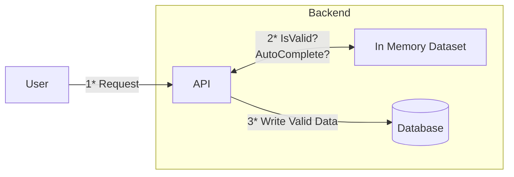

# GoFuzzy

Fuzzy search library backed by an in-memory [Trie](https://en.wikipedia.org/wiki/Trie).


## Getting Started

First the dataset has to be indexed in a trie:
```go
import (
    "github.com/marcadamsge/gofuzzy/fuzzy"
    "github.com/marcadamsge/gofuzzy/trie"
)

// Create a new Trie and specify the type that it will be storing
myTrie := trie.New[string]()

// Somehow load your dataset
blue := "blue"
green := "green"
black := "black"

// Define how your data points should be merged together
// This is used by the trie.Insert function in case there's duplicates
// Here we simply take one of the non nil values,
// we know there won't be duplicates anyway
combineFunction := func(t1 *string, t2 *string) *string {
    if t1 != nil {
        return t1
    }

    return t2
}

// Index data in Trie
myTrie.Insert(blue, &blue, combineFunction)
myTrie.Insert(green, &green, combineFunction)
myTrie.Insert(black, &black, combineFunction)

// Define how the Fuzzy search algorithm should collect data
// This lets you define:
//   1. When enough data has been collected
//   2. How the data should be collected
myCollector := fuzzy.NewListCollector[string](3)

// Run the search
fuzzy.Search[string](myTrie, "bue", 1, myCollector)

result := myCollector.Results
```

The example can be found [here](examples/colors/color_test.go).


## Motivations
Memory is getting cheaper and larger, reference datasets can be loaded completely in memory on servers and used both for:

1. Validating input data
2. Providing an autocomplete endpoint



Notice that here:

1. The reference data set is loaded in memory, it does not need to be maintained in a separate DB
2. The Database is only being written to, there's no reading operation needed
