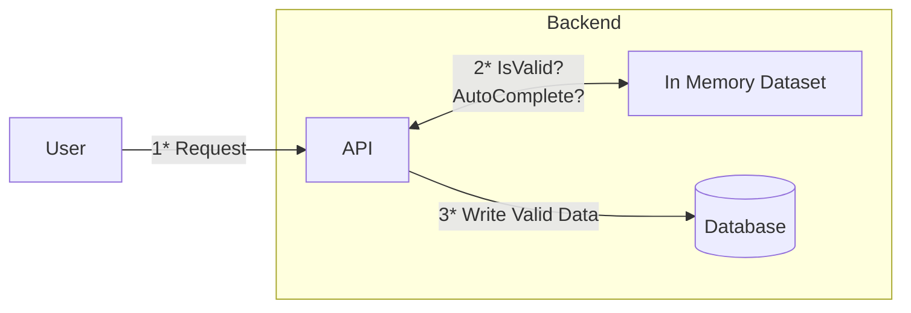

# GoFuzzy

In-memory fuzzy search library on strings as measured by a Levenshtein edit distance.

## Getting Started

The fuzzy search function uses an in-memory [Trie](https://en.wikipedia.org/wiki/Trie).
The dataset has to be indexed in a trie first, and then we can execute some fuzzy matching:

```go
import (
	"context"
	"github.com/marcadamsge/gofuzzy/fuzzy"
	"github.com/marcadamsge/gofuzzy/trie"
)

// Create a new Trie and specify the type that it will be storing
myTrie := trie.New[string]()

// Somehow load your dataset
blue := "blue"
green := "green"
black := "black"

// Define how your data points should be merged together
// This is used by the trie.Insert function in case there's duplicates
// Here we simply take one of the non nil values,
// we know there won't be duplicates anyway
combineFunction := func(t1 *string, t2 *string) *string {
    if t1 != nil {
        return t1
    }

    return t2
}

// Index data in Trie
myTrie.Insert(blue, &blue, combineFunction)
myTrie.Insert(green, &green, combineFunction)
myTrie.Insert(black, &black, combineFunction)

// Define how the Fuzzy search algorithm should collect data
// This lets you define:
//   1. When enough data has been collected
//   2. How the data should be collected
myCollector := fuzzy.NewListCollector[string](3)

// Run the search
fuzzy.Search[string](context.Background(), myTrie, "bue", 1, myCollector)

result := myCollector.Results
```

The example can be found [here](examples/colors/color_test.go).

## Motivations

Memory is getting cheaper and larger, reference datasets can be loaded completely in memory on servers and used both
for:

1. Validating input data
2. Providing an autocomplete endpoint



Notice that here:

1. The reference data set is loaded in memory, it does not need to be maintained in a separate DB
2. The Database is only being written to, there's no reading operation needed

## Performance

There's a little performance test based on geonames [here](examples/geonames/main.go).
The test indexes the cities by name from the data set, and then for each entry applies some random error and then
queries it again. The number of errors depends on the length of the name:

- 0 error if 0 < len(city_name) <= 2
- 1 error if 2 < len(city_name) <= 5
- 2 errors otherwise

To run it you can download the `allCountries.zip` dataset from [geonames](http://download.geonames.org/export/dump/),
extract it, and then run:

```
~$ go install github.com/marcadamsge/gofuzzy/examples/geonames@latest
~$ ./go/bin/geonames -geo allCountries.txt -n 20 -threads 12
loading file...
dataset loaded in 12.777391 seconds
4925661 lines parsed, 4925661 elements inserted in the trie
triggering manual GC...
Allocated Memory = 2984 MiB
starting performance test...
100% done
results:
length: 0 min, 148 max, 10.246060 average
time (in nano second): 299 min, 181557838 max, 20391663.284386 average
total test time: 8386.500951s
number of mallocs: 159257259696
time in GC 695696584ns
```

After indexing the data set a GC is manually triggered to see how much memory is needed to have the whole dataset in
memory.
Here 4 925 661 elements were indexed, taking up 2984MB of memory.
This test was run on a AMD Ryzen™ 7 5700G.
Result:

| Metric               | Min            | Max             | Average        |
|----------------------|----------------|-----------------|----------------|
| Search string length | 0              | 148             | 10.24          |
| Query time           | 299 nanosecond | 181 millisecond | 20 millisecond |
