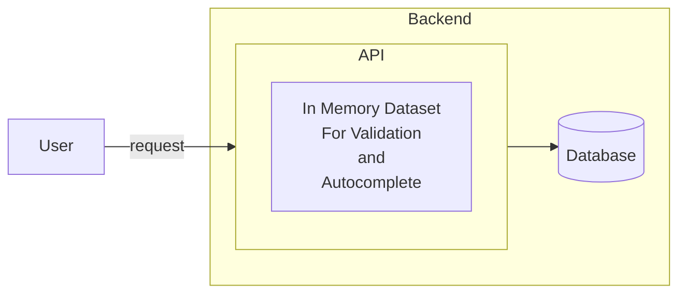

# GoFuzzy

Fuzzy search library backed by an in-memory [Trie](https://en.wikipedia.org/wiki/Trie). Memory is getting cheaper and
larger, reference datasets can be loaded completely in memory on servers and used both for:

1. Validating input data
2. Providing an autocomplete endpoint

The main use case of this library is to help on the autocomplete endpoint.
